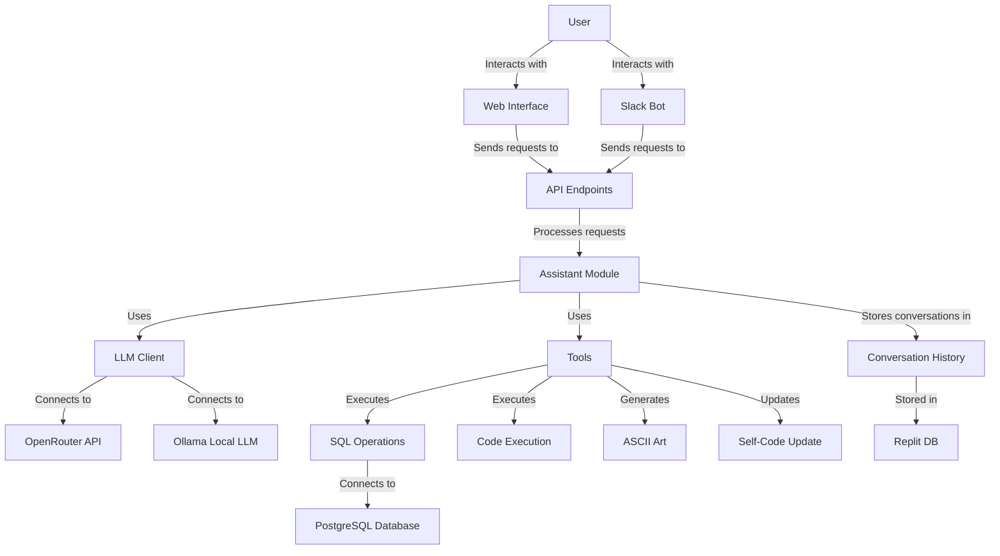
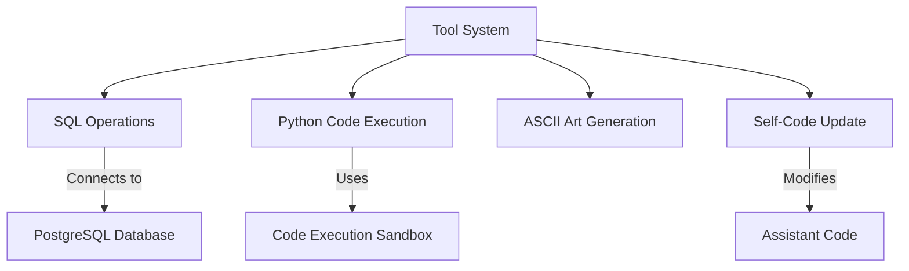
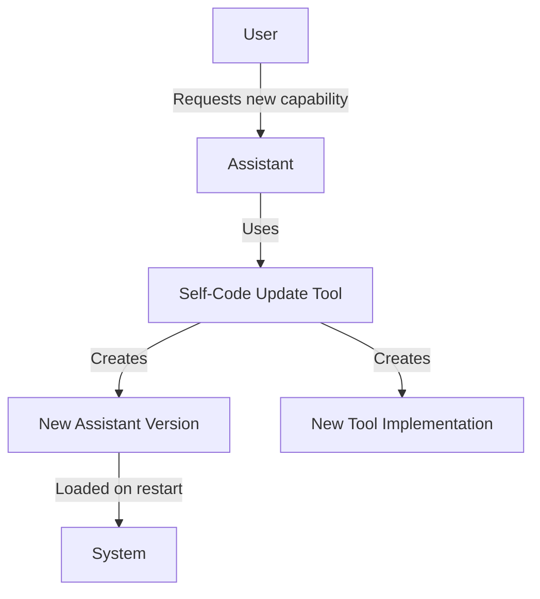

# Computer Architecture

This document provides a detailed overview of the architecture of the Computer self-modifying AI assistant.

## System Overview

Computer is a self-modifying AI assistant that can update its own code, add new capabilities, and adapt to user needs in real-time. It supports multiple LLM providers, has database integration, and includes various tools for SQL operations, Python code execution, and ASCII art generation.

## Core Components

### 1. Assistant Module

The assistant module is the core of the system, responsible for:
- Processing user requests
- Calling the LLM
- Managing tools
- Handling conversation history

The assistant has multiple versions (v1-v4) with increasing capabilities, and can be dynamically loaded at runtime.

Key files:
- `src/assistant.py`: Base assistant implementation
- `src/assistant_v4.py`: Latest version with PostgreSQL support

### 2. LLM Clients

The system supports multiple LLM providers:
- OpenRouter for cloud-based models
- Ollama for local models

Key files:
- `src/LLM_client_openrouter.py`: Client for OpenRouter API
- `src/LLM_client_ollama.py`: Client for Ollama local models

### 3. Tool System

The tool system provides extensible capabilities to the assistant:

Key files:
- `src/tools/sql_postgres.py`: PostgreSQL database operations
- `src/tools/eval.py`: Python code execution
- `src/tools/ascii_art_generator.py`: ASCII art generation
- `src/tools/self_aware.py`: Self-modification capabilities

### 4. Web and Slack Interfaces

The system provides multiple interfaces:
- Web interface using Flask
- Slack bot integration

Key files:
- `src/main.py`: Flask web server and API endpoints
- `src/bot_slack.py`: Slack bot implementation

### 5. Security

Security measures are implemented throughout the system:
- Input sanitization
- SQL validation
- Sandboxed code execution
- Authentication for API endpoints

Key files:
- `src/utils/security.py`: Security utilities

## Data Flow

1. User sends a message through the web interface or Slack
2. The message is received by the API endpoint
3. The assistant processes the message and determines if tools are needed
4. If tools are needed, they are executed and their responses are added to the conversation
5. The assistant generates a response using the LLM
6. The response is sent back to the user
7. The conversation history is stored in Replit DB

## Self-Modification Capability

The self-modification capability is a key feature of Computer:

When a user requests a new capability:
1. The assistant uses the `self-code-update` tool
2. A new version file is created (e.g., assistant_v5.py)
3. The new tool implementation is added to the tools directory
4. The system must be restarted to load the new version

## Configuration

The system is configured using environment variables:
- API keys and credentials
- Database connection details
- Feature flags
- LLM model selection

Key files:
- `.env.example`: Template for environment variables
- `src/utils/config.py`: Configuration loading and management
- `src/utils/env_loader.py`: Environment variable loading

## Future Architecture Enhancements

Planned architectural improvements include:
- Microservices architecture for better scalability
- Containerization for easier deployment
- Enhanced security model
- Plugin system for third-party extensions
- Improved conversation memory management